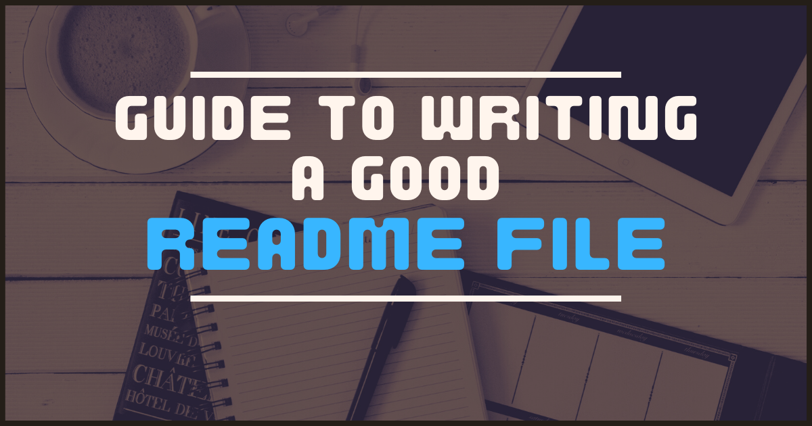
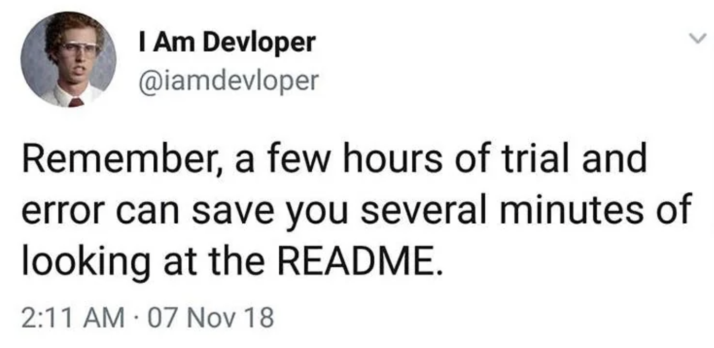

<style>
/*body {*/
/*    font-family: "Times New Roman", Times, serif;*/
/*}*/
</style>

<style>
r { color: Red }
o { color: Orange }
g { color: Green }
</style>

# TODOs:

- <r>TODO:</r> Important thing to do
- <o>TODO:</o> Less important thing to do
- <g>DONE:</g> Breath deeply and improve karma

# Was gehört alles in eine README?

## 1. Projekttitel

Name des Projekts, aus dem klar wird, worum es geht.

## 2. Projektbeschreibung

Ein kurzer Absatz darüber...

* Was das Projekt macht
  * Spiel, App, Library, ...
* in welcher Sprache es geschrieben ist
  * Kotlin, Swift, ...
    
## 3. Installation
* Wie man das Projekt installiert und zum Laufen bringt (Step by Step Anleitung)
    * Einfach Clonen oder spezielle Installation?
    * Wird eine bestimmte IDE, zusätzliche Libraries oder ein anderes Programm benötigt?

* Wie man das Projekt benutzt
  * Wo ist der Einstiegspunkt, wie führt man es aus
  * Wie bedient man es
  

## 4.  Features
  * Die wichtigsten (=Key) Features, um zu zeigen, was das Projekt alles kann
---

<h1 style="color: lightgreen;">Textformatierung in Markdown</h1>

<span style="color: blue;">blue</span>

<span style="color:orange">Brainstorming</span>


<r> Hier seht ihr noch einige Beispiele zum Formatieren von Text: </r>

Die Liste kann auch nummeriert sein:
1. Punkt1
    1. Unterpunkt
        1. Unterunterpunkt
2. Punkt2
Man kann auch Checkboxen auflisten:
- [x] Checkliste eingebaut
- [ ] Checkliste ist klickbar in Preview? 

___

- Um eine neue Zeile anzufangen, brauche ich einen line-break.
Dafür gibt es 3 Möglichkeiten:

a) Ich lasse eine extra Zeile frei.  
b) Ich schreibe 2 Leerzeichen am Ende einer Zeile.<br>
c) Oder ich nutze das Zeichen `<br>`


- **So** schreibe ich text in bold oder __so__.  
- _So_ schreibe ich text in *italics*.  
- Man kann das auch ***kombinieren***.
- ~~So~~ schreibe ich durchgestrichenen Text.  
- Ich kann wenn ich möchte `Code` in eine Zeile schreiben.  
- Oder ich schreibe einen gesamten Code-Block
```Kotlin
var x: Boolean = true
println("Dear Readme, today I ...")
```

<details><summary>Ausklappbare Detail Section</summary>
Dieser Text wird nur angezeigt, wenn ich ihn aufklicke.
</details>

---

# So baut man Links ein:

Link zum Repo: 
[B13 LiveBeispiele](https://github.com/SI-Classroom-Batch-013/B13-LiveBeispiele)

IntelliJ Markdown Guide:
https://www.jetbrains.com/help/upsource/markdown-syntax.html#Headings

Offizieller Markdown Guide:
https://www.markdownguide.org/

[Readme Guide (Was hinein gehört)](https://www.freecodecamp.org/news/how-to-write-a-good-readme-file/)

Denkt immer dran:



---


